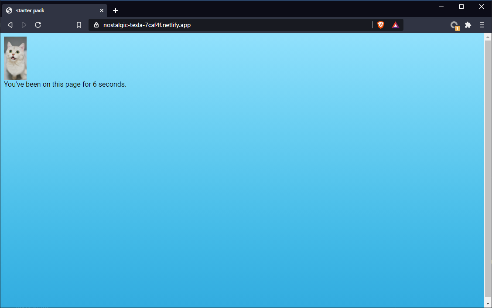

# SA2 - Starterpack
## CS52 Spring 2021, Derek Lu

This is the starterpack created for SA2, comprising of tools like Webpack, Babel, and Eslint.

[deployed url](https://nostalgic-tesla-7caf4f.netlify.app/)

## What Worked Well
Overall set up went fine, the instructions were clear and mostly easy to follow.

## What Didn't
There were some difficulties in getting certain commands to work, as I was on Windows 10, but these issues resolved themselves
quite quickly.

## Extra Credit
I added in an image compressor/minimizer [ImageMinimizerWebpackPlugin](https://webpack.js.org/plugins/image-minimizer-webpack-plugin/),
which replaces the file loader we implemented in class. Here, I turned the compression on JPGs to be very lossy just to ensure
the loader was working properly. I've commented out the default file loader in [webpack.config.js](webpack.config.js).

## Screenshots
